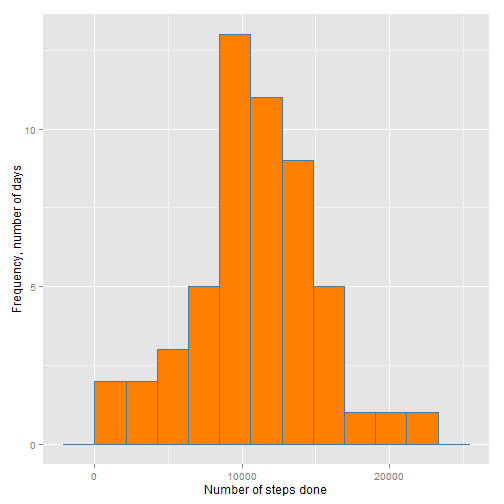

---
output:
  html_document: default
---
Programming Assignment 1
========================
**Reproducible Reseach Course on Coursera**  
*by Roger D. Peng, PhD, Jeff Leek, PhD, Brian Caffo, PhD*  
*Johns Hopkins Bloomberg School of PULIC HEALTH*

Alexey Shovkun  
Monday, November 10, 2014


##Analysis Report
###Data Codebook
The data were collected from a personal activity monitoring device. This device collects data at 5 minute intervals through out the day. The data consists of two months of data from an anonymous individual collected during the months of October and November, 2012 and include the number of steps taken in 5 minute intervals each day.

The data for this study are stored in the 'activity.zip' file in the root of repository. Inside this archive there in a comma-separated-value (CSV) file with the dataset wich has 17,568 observations in it.

The variables included in this dataset are:

- **steps**: Number of steps taking in a 5-minute interval (missing values are coded as NA).

- **date**: The date on which the measurement was taken in YYYY-MM-DD format.

- **interval**: Identifier for the 5-minute interval in which measurement was taken.


###Loading and preprocessing the data

Load the data into `activity` symbol assuming that working directory is set to the root of source code repository and contains `activity.zip` file.

```r
activity <- read.csv(unz("activity.zip", "activity.csv"))
```

Convert `date` variable from Factor of characters to Date class. Also decode `interval` from "%H%M" code to DateTime class variable.

```r
library(lubridate) #for parse_date_time()
activity$date <- as.Date(activity$date, "%Y-%m-%d")
activity$intervalDT <- parse_date_time (formatC(activity$interval, width=4, flag="0"), "H!M!")
```


###What is mean total number of steps taken per day?

In this part of the assignment, we'll ignore the missing values in the dataset.
We'll use `ggplot` plotting system and `RColorBrewer` colors in this report.  
Make a _histogram_ of the total number of steps taken each day (not a barplot, see [this discussion](https://class.coursera.org/repdata-008/forum/thread?thread_id=17) for details).

```r
library (ggplot2) 
library (RColorBrewer) #for brewer.pal()
stepsbyday <- aggregate (steps ~ date, activity, sum)
# Temporary change system locate to get english spoken dates
if (!exists('mylocale')) mylocale <- Sys.getlocale (category = "LC_TIME")
invisible(Sys.setlocale  (category = "LC_TIME", locale = "C"))
colors <- brewer.pal(5, "Set1") # Nice colors palette
ggplot (data = stepsbyday, aes(x = steps)) +
    geom_histogram(binwidth = max(stepsbyday$steps)%/%10, col = colors[2], fill = colors[5]) +
    labs (y = "Frequency, number of days", x = "Number of steps done")
```

 

Calculate and report the mean and median total number of steps taken per day.

```r
stepsmean <- as.character(round(mean(stepsbyday$steps, na.rm = TRUE),1))
stepsmedian <- as.character( round(median(stepsbyday$steps, na.rm = TRUE),1))
```
Mean is **10766.2** and median **10765** is steps taken per day.

###What is the average daily activity pattern?

Make a time series plot of the 5-minute interval (x-axis) and the average number of steps taken, averaged across all days (y-axis). We use 'time' representation of the interval instead of original 'military' coded format to have equal spacing on the horizontal axis.

```r
library(scales) #for date_format()
stepsbyinterval <- aggregate (steps ~ interval + intervalDT, data = activity, FUN = mean)
ggplot (data = stepsbyinterval, aes(x = intervalDT, y = steps)) +
     geom_line(size = 1.5, col = colors[5]) +
     scale_x_datetime(labels = date_format("%H:%M")) +
     labs (x = "Time, 5-minute interval", y = "Average number of steps")
```

 

Which 5-minute interval, on average across all the days in the dataset, contains the maximum number of steps?

```r
maxIntervalCode <- stepsbyinterval[which.max(stepsbyinterval$steps), 1]
maxIntervalStart <- stepsbyinterval[which.max(stepsbyinterval$steps), ]$intervalDT
maxIntervalEnd <- maxIntervalStart + minutes(5)
maxInterval <- paste0('[', as.character.Date(maxIntervalStart,format = "%H:%M"), ', ',
                      as.character.Date(maxIntervalEnd,format = "%H:%M"), ')')
```
The time interval with the maximum average number of steps has code **835** which means time interval **[08:35, 08:40)**.

###Imputing missing values

The dataset has a number of days/intervals where there are missing values (coded as NA). The presence of missing days may introduce bias into some calculations or summaries of the data.

Calculate and report the total number of missing values in the dataset (i.e. the total number of rows with NAs).

```r
print(sum(is.na(activity$steps)))
```

```
## [1] 2304
```

Now fill in all of the missing values in the dataset. In the next chunk we replace each NA with the mean for that 5-minute interval and create a new dataset that is equal to the original dataset but with the missing data filled in.

```r
library (dplyr)
imputed <- select (stepsbyinterval, interval, mean = steps) %>%
    inner_join(activity, by = c("interval"="interval")) %>%
    mutate(steps = ifelse(is.na(steps), mean, steps)) %>%
    select (-mean)
```

Make a histogram of the total number of steps taken each day, calculate and report the mean and median total number of steps taken per day. Do these values differ from the estimates from the first part of the assignment? What is the impact of imputing missing data on the estimates of the total daily number of steps?

```r
imputedbyday <- aggregate (steps ~ date, imputed, sum)
ggplot (data = imputedbyday, aes(x = steps)) +
    geom_histogram(binwidth = max(imputedbyday$steps)%/%10, col = colors[5], fill = colors[2]) +
    labs (y = "Frequency, number of days", x = "Number of steps done")
```

 

```r
imputedmean <- as.character(round(mean(imputedbyday$steps),1))
imputedmedian <- as.character( round(median(imputedbyday$steps),1))
```
After replacement of NA values by interval's mean, mean became equal to **10766.2** and median to **10766.2** steps taken per day. The median differs from one of the first part of the study, but mean remains the same. Now median is equal to mean. 

###Are there differences in activity patterns between weekdays and weekends?

Use the dataset with the filled-in missing values for this part. Create a new factor variable in the dataset with two levels – “weekday” and “weekend” indicating whether a given date is a weekday or weekend day.

```r
weekends <- c( 'Saturday', 'Sunday')
imputed$weekday <- factor(ifelse(weekdays(imputed$date) %in% weekends ,1,0 ), levels = c(0,1), 
                          labels = c("weekday", "weekend"))
```

Make a panel plot containing a time series plot of the 5-minute interval (x-axis) and the average number of steps taken, averaged across all weekday days or weekend days (y-axis). 


```r
imputedbyinterval <- aggregate (steps ~ interval+intervalDT+weekday, imputed, mean)
ggplot(imputedbyinterval, aes(x = intervalDT, y = steps)) + 
    geom_line(size = 0.8, col = colors[2]) +
    scale_x_datetime(labels = date_format("%H:%M")) +
    facet_wrap (~ weekday, ncol = 1) +
    labs (x = "Time, 5-minute interval", y = "Average number of steps")
```

 

From the plot we can see that activity patterns **are different** between weekdays and weekends.

Restore original locale at the end.

```r
Sys.setlocale  (category = "LC_TIME", locale = mylocale) #restore locale
```

